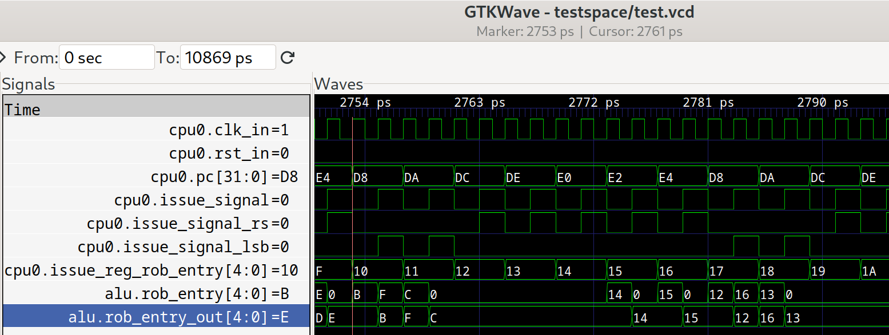

# 程序
### .c文件
```#include "io.h"
int a[100] = {1, 2, 3, 4, 5 , 6, 7, 8, 9, 10 }; 
int b[100] = {10, 9, 8, 7, 6, 5, 4, 3, 2, 1 }; 
int main(){
    int e = 5; int c = 9; int d = 1; 
    for (int i = 0; i < 100; ++i){
        a[i] = i; b[i] = i; 
    }
    for (int i = 0; i < 100; ++i){
        c += a[i] + b[i]; e = d + e; 
    }
    outl(c); 
    outl(e); 
}
```
我的cpu将在第二个循环里出现乱序执行
### 编译参数 
-O1 
ic
### 汇编代码
只展示循环部分
```
  d8:	431c                	lw	a5,0(a4)
  da:	4214                	lw	a3,0(a2)
  dc:	97b6                	add	a5,a5,a3
  de:	953e                	add	a0,a0,a5
  e0:	0711                	addi	a4,a4,4
  e2:	0611                	addi	a2,a2,4
  e4:	feb71ae3          	bne	a4,a1,d8 <main+0x2c>
  ```
# 乱序解释
### 波形图截图

### 乱序
| rob_entry | pc  | instruction   |
|-----------|-----|---------------|
| 12        | dc  | add a5,a5,a3  |
| 13        | de  | add a0,a0,a5  |
| 14        | e0  | addi a4,a4,4  |
| 15        | e2  | addi a2,a2,4  |

波形图中可以看到 rob_entry = 12&13 的指令先于 rob_entry = 14&15 的指令 issue ，然而，因为 12&13 的 lw 依赖未解决，14&15先于 12&13 提交到 alu